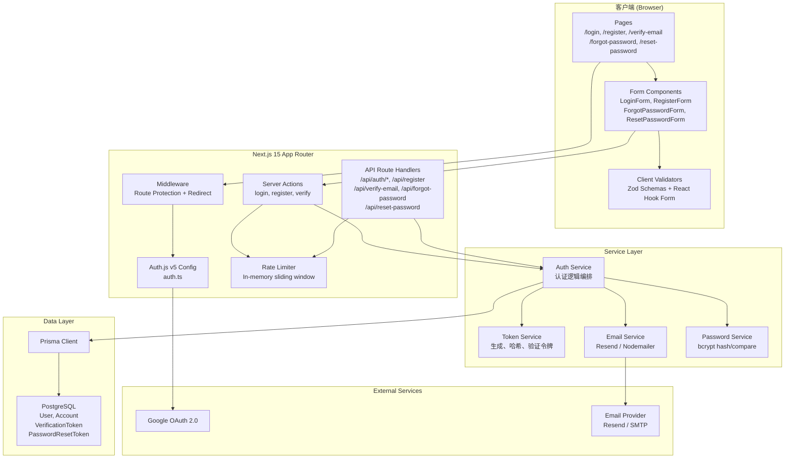
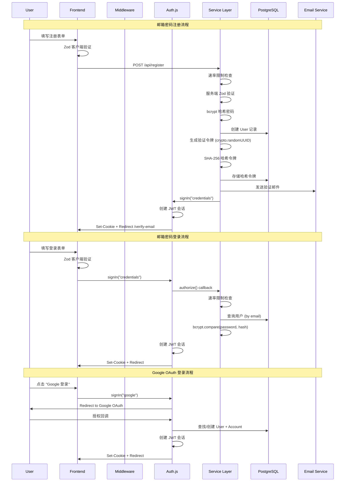

# Design Document: Auth Login & Register

## Overview

本设计文档描述了用户认证系统的技术架构和实现方案，涵盖邮箱密码注册/登录、Google OAuth 社交登录、邮箱验证、忘记密码/重置密码、会话管理以及安全防护等核心功能。

系统基于 Auth.js v5（NextAuth v5）构建，采用 JWT 会话策略，使用 Prisma ORM 与 PostgreSQL 数据库交互。前端使用 Next.js 15 App Router 架构，结合 React 19 和 Tailwind CSS v4 实现响应式 UI。

### 设计目标

- **安全性**: bcrypt 密码哈希、SHA-256 令牌哈希、CSRF 保护、速率限制
- **用户体验**: 实时表单验证、密码强度指示器、客户端路由导航
- **可维护性**: 清晰的分层架构、类型安全、模块化设计
- **可扩展性**: 支持未来添加更多 OAuth 提供者和认证方式

## Architecture

### 系统架构图



### 认证流程图



### 目录结构

```
src/
├── app/
│   ├── (auth)/
│   │   ├── login/page.tsx
│   │   ├── register/page.tsx
│   │   ├── verify-email/page.tsx
│   │   ├── forgot-password/page.tsx
│   │   ├── reset-password/page.tsx
│   │   └── layout.tsx
│   ├── api/
│   │   ├── auth/[...nextauth]/route.ts
│   │   ├── register/route.ts
│   │   ├── verify-email/route.ts
│   │   ├── forgot-password/route.ts
│   │   ├── reset-password/route.ts
│   │   └── resend-verification/route.ts
│   └── layout.tsx
├── auth.ts                    # Auth.js v5 配置
├── auth.config.ts             # Auth.js edge-compatible 配置
├── middleware.ts              # Next.js middleware
├── lib/
│   ├── prisma.ts              # Prisma client singleton
│   ├── tokens.ts              # Token 生成与验证
│   ├── password.ts            # bcrypt 工具
│   ├── email.ts               # 邮件发送
│   ├── rate-limit.ts          # 速率限制
│   └── validations.ts         # Zod schemas (共享)
├── components/
│   ├── auth/
│   │   ├── login-form.tsx
│   │   ├── register-form.tsx
│   │   ├── forgot-password-form.tsx
│   │   ├── reset-password-form.tsx
│   │   ├── social-button.tsx
│   │   ├── password-strength.tsx
│   │   └── form-field.tsx
│   └── ui/
│       ├── button.tsx
│       ├── input.tsx
│       └── spinner.tsx
├── actions/
│   ├── login.ts
│   ├── register.ts
│   └── reset-password.ts
└── prisma/
    └── schema.prisma
```

## Components and Interfaces

### 1. Auth.js v5 配置 (`auth.ts`)

```typescript
// auth.ts
import NextAuth from "next-auth";
import { PrismaAdapter } from "@auth/prisma-adapter";
import Google from "next-auth/providers/google";
import Credentials from "next-auth/providers/credentials";
import { prisma } from "@/lib/prisma";
import { loginSchema } from "@/lib/validations";
import { verifyPassword } from "@/lib/password";

export const { handlers, signIn, signOut, auth } = NextAuth({
  adapter: PrismaAdapter(prisma),
  session: { strategy: "jwt", maxAge: 7 * 24 * 60 * 60 }, // 7 days
  pages: {
    signIn: "/login",
    error: "/login",
  },
  providers: [
    Google({
      clientId: process.env.GOOGLE_CLIENT_ID!,
      clientSecret: process.env.GOOGLE_CLIENT_SECRET!,
      authorization: {
        params: { scope: "openid email profile" },
      },
    }),
    Credentials({
      async authorize(credentials) {
        const validated = loginSchema.safeParse(credentials);
        if (!validated.success) return null;

        const { email, password } = validated.data;
        const user = await prisma.user.findUnique({ where: { email } });
        if (!user || !user.hashedPassword) return null;

        const isValid = await verifyPassword(password, user.hashedPassword);
        if (!isValid) return null;

        return {
          id: user.id,
          email: user.email,
          name: user.displayName,
          image: user.image,
        };
      },
    }),
  ],
  callbacks: {
    async signIn({ user, account }) {
      // Google OAuth 用户自动标记邮箱已验证
      if (account?.provider === "google") return true;
      // Credentials 用户允许登录（邮箱验证在业务层处理）
      return true;
    },
    async jwt({ token, user, trigger }) {
      if (user) {
        token.id = user.id;
        token.email = user.email;
        token.name = user.name;
        // 从数据库获取当前 tokenVersion
        const dbUser = await prisma.user.findUnique({
          where: { id: user.id },
          select: { tokenVersion: true },
        });
        token.tokenVersion = dbUser?.tokenVersion ?? 0;
      }

      // 每次请求验证 tokenVersion 是否仍然有效
      if (token.id) {
        const dbUser = await prisma.user.findUnique({
          where: { id: token.id as string },
          select: { tokenVersion: true },
        });
        if (!dbUser || dbUser.tokenVersion !== token.tokenVersion) {
          // tokenVersion 不匹配，会话已被撤销
          return { ...token, invalid: true };
        }
      }

      return token;
    },
    async session({ session, token }) {
      if (token.invalid) {
        // 返回空 session 触发重新登录
        return { ...session, user: undefined } as any;
      }
      if (token) {
        session.user.id = token.id as string;
        session.user.email = token.email as string;
        session.user.name = token.name as string;
      }
      return session;
    },
  },
  events: {
    async linkAccount({ user }) {
      // OAuth 账户关联时自动验证邮箱
      await prisma.user.update({
        where: { id: user.id },
        data: { emailVerified: new Date() },
      });
    },
  },
});
```

### 2. Middleware (`middleware.ts`)

```typescript
// middleware.ts
import { auth } from "@/auth";
import { NextResponse } from "next/server";

const publicRoutes = [
  "/login",
  "/register",
  "/verify-email",
  "/forgot-password",
  "/reset-password",
];
const authRoutes = ["/login", "/register"];

export default auth((req) => {
  const { nextUrl } = req;
  const isLoggedIn = !!req.auth;
  const isPublicRoute = publicRoutes.some((route) =>
    nextUrl.pathname.startsWith(route)
  );
  const isAuthRoute = authRoutes.some((route) =>
    nextUrl.pathname.startsWith(route)
  );
  const isApiAuthRoute = nextUrl.pathname.startsWith("/api/auth");

  // Auth API 路由始终允许
  if (isApiAuthRoute) return NextResponse.next();

  // 已登录用户访问登录/注册页面 → 重定向到首页
  if (isAuthRoute && isLoggedIn) {
    return NextResponse.redirect(new URL("/", nextUrl));
  }

  // 未登录用户访问受保护页面 → 重定向到登录页
  if (!isPublicRoute && !isLoggedIn) {
    const callbackUrl = encodeURIComponent(nextUrl.pathname + nextUrl.search);
    return NextResponse.redirect(
      new URL(`/login?callbackUrl=${callbackUrl}`, nextUrl)
    );
  }

  return NextResponse.next();
});

export const config = {
  matcher: ["/((?!_next|[^?]*\\.(?:html?|css|js|jpe?g|webp|png|gif|svg|ttf|woff2?|ico|csv|docx?|xlsx?|zip|webmanifest)).*)"],
};
```

### 3. Token Service (`lib/tokens.ts`)

```typescript
// lib/tokens.ts
import crypto from "crypto";
import { prisma } from "@/lib/prisma";

export function generateToken(): string {
  return crypto.randomUUID();
}

export function hashToken(token: string): string {
  return crypto.createHash("sha256").update(token).digest("hex");
}

export async function createVerificationToken(email: string): Promise<string> {
  const token = generateToken();
  const hashedToken = hashToken(token);
  const expires = new Date(Date.now() + 24 * 60 * 60 * 1000); // 24 hours

  // 删除该邮箱之前的所有验证令牌
  await prisma.verificationToken.deleteMany({
    where: { identifier: email },
  });

  await prisma.verificationToken.create({
    data: {
      identifier: email,
      token: hashedToken,
      expires,
    },
  });

  return token; // 返回明文令牌用于邮件链接
}

export async function createPasswordResetToken(email: string): Promise<string> {
  const token = generateToken();
  const hashedToken = hashToken(token);
  const expires = new Date(Date.now() + 60 * 60 * 1000); // 1 hour

  // 删除该邮箱之前的所有重置令牌
  await prisma.passwordResetToken.deleteMany({
    where: { identifier: email },
  });

  await prisma.passwordResetToken.create({
    data: {
      identifier: email,
      token: hashedToken,
      expires,
    },
  });

  return token;
}

export async function verifyToken(
  token: string,
  type: "verification" | "passwordReset"
): Promise<{ valid: boolean; identifier?: string; expired?: boolean }> {
  const hashedToken = hashToken(token);

  const record =
    type === "verification"
      ? await prisma.verificationToken.findFirst({
          where: { token: hashedToken },
        })
      : await prisma.passwordResetToken.findFirst({
          where: { token: hashedToken },
        });

  if (!record) return { valid: false };
  if (record.expires < new Date()) return { valid: false, expired: true };

  return { valid: true, identifier: record.identifier };
}

export async function consumeToken(
  token: string,
  type: "verification" | "passwordReset"
): Promise<void> {
  const hashedToken = hashToken(token);

  if (type === "verification") {
    await prisma.verificationToken.deleteMany({
      where: { token: hashedToken },
    });
  } else {
    await prisma.passwordResetToken.deleteMany({
      where: { token: hashedToken },
    });
  }
}
```

### 4. Password Service (`lib/password.ts`)

```typescript
// lib/password.ts
import bcrypt from "bcrypt";

const SALT_ROUNDS = 10; // cost factor ≥ 10

export async function hashPassword(password: string): Promise<string> {
  return bcrypt.hash(password, SALT_ROUNDS);
}

export async function verifyPassword(
  password: string,
  hashedPassword: string
): Promise<boolean> {
  return bcrypt.compare(password, hashedPassword);
}
```

### 5. Rate Limiter (`lib/rate-limit.ts`)

```typescript
// lib/rate-limit.ts

interface RateLimitEntry {
  count: number;
  timestamps: number[];
  lockedUntil?: number;
}

const store = new Map<string, RateLimitEntry>();

interface RateLimitConfig {
  windowMs: number;    // 滑动窗口时间（毫秒）
  maxAttempts: number; // 窗口内最大尝试次数
  lockoutMs?: number;  // 锁定时间（毫秒），可选
}

export function checkRateLimit(
  key: string,
  config: RateLimitConfig
): { allowed: boolean; retryAfterMs?: number } {
  const now = Date.now();
  const entry = store.get(key);

  // 检查是否处于锁定状态
  if (entry?.lockedUntil && entry.lockedUntil > now) {
    return { allowed: false, retryAfterMs: entry.lockedUntil - now };
  }

  // 清除锁定（如果已过期）
  if (entry?.lockedUntil && entry.lockedUntil <= now) {
    store.delete(key);
    return { allowed: true };
  }

  if (!entry) {
    store.set(key, { count: 1, timestamps: [now] });
    return { allowed: true };
  }

  // 过滤窗口内的时间戳
  const windowStart = now - config.windowMs;
  entry.timestamps = entry.timestamps.filter((t) => t > windowStart);
  entry.count = entry.timestamps.length;

  if (entry.count >= config.maxAttempts) {
    // 触发锁定
    if (config.lockoutMs) {
      entry.lockedUntil = now + config.lockoutMs;
      store.set(key, entry);
      return { allowed: false, retryAfterMs: config.lockoutMs };
    }
    return { allowed: false, retryAfterMs: config.windowMs };
  }

  entry.timestamps.push(now);
  entry.count++;
  store.set(key, entry);
  return { allowed: true };
}

export function recordFailedAttempt(key: string): void {
  // 已在 checkRateLimit 中记录
}

// 预定义配置
export const LOGIN_RATE_LIMIT: RateLimitConfig = {
  windowMs: 15 * 60 * 1000,  // 15 分钟
  maxAttempts: 5,
  lockoutMs: 15 * 60 * 1000, // 锁定 15 分钟
};

export const FORGOT_PASSWORD_RATE_LIMIT: RateLimitConfig = {
  windowMs: 15 * 60 * 1000,  // 15 分钟
  maxAttempts: 3,
};

export const RESEND_VERIFICATION_RATE_LIMIT: RateLimitConfig = {
  windowMs: 5 * 60 * 1000,   // 5 分钟
  maxAttempts: 3,
};
```

### 6. Validation Schemas (`lib/validations.ts`)

```typescript
// lib/validations.ts
import { z } from "zod";

export const emailSchema = z
  .string()
  .min(1, "邮箱不能为空")
  .max(254, "邮箱长度不能超过 254 个字符")
  .email("请输入有效的邮箱地址");

export const displayNameSchema = z
  .string()
  .min(1, "显示名称不能为空")
  .min(2, "显示名称至少需要 2 个字符")
  .max(50, "显示名称不能超过 50 个字符")
  .refine((val) => val === val.trim(), "显示名称不能包含前后空格");

export const passwordSchema = z
  .string()
  .min(1, "密码不能为空")
  .min(8, "密码至少需要 8 个字符")
  .max(128, "密码长度不能超过 128 个字符")
  .regex(/[A-Z]/, "密码必须包含至少一个大写字母")
  .regex(/[a-z]/, "密码必须包含至少一个小写字母")
  .regex(/[0-9]/, "密码必须包含至少一个数字");

export const registerSchema = z
  .object({
    email: emailSchema,
    displayName: displayNameSchema,
    password: passwordSchema,
    confirmPassword: z.string().min(1, "请确认密码"),
  })
  .refine((data) => data.password === data.confirmPassword, {
    message: "两次输入的密码不一致",
    path: ["confirmPassword"],
  });

export const loginSchema = z.object({
  email: z
    .string()
    .min(1, "邮箱不能为空")
    .email("请输入有效的邮箱地址"),
  password: z.string().min(1, "密码不能为空"),
});

export const forgotPasswordSchema = z.object({
  email: emailSchema,
});

export const resetPasswordSchema = z
  .object({
    password: passwordSchema,
    confirmPassword: z.string().min(1, "请确认密码"),
  })
  .refine((data) => data.password === data.confirmPassword, {
    message: "两次输入的密码不一致",
    path: ["confirmPassword"],
  });

// 密码强度计算
export type PasswordStrength = "weak" | "medium" | "strong" | "very-strong";

export function calculatePasswordStrength(password: string): PasswordStrength {
  if (password.length < 8) return "weak";

  const hasUpper = /[A-Z]/.test(password);
  const hasLower = /[a-z]/.test(password);
  const hasNumber = /[0-9]/.test(password);
  const hasSpecial = /[^A-Za-z0-9]/.test(password);

  const typesCount = [hasUpper, hasLower, hasNumber, hasSpecial].filter(Boolean).length;

  if (hasUpper && hasLower && hasNumber && hasSpecial && password.length >= 12) {
    return "very-strong";
  }
  if (hasUpper && hasLower && hasNumber) {
    return "strong";
  }
  if (typesCount >= 2) {
    return "medium";
  }
  return "weak";
}
```

### 7. Email Service (`lib/email.ts`)

```typescript
// lib/email.ts

interface SendEmailOptions {
  to: string;
  subject: string;
  html: string;
}

export async function sendEmail(options: SendEmailOptions): Promise<void> {
  // 使用 Resend 或 Nodemailer 发送邮件
  // 具体实现取决于环境配置
}

export async function sendVerificationEmail(
  email: string,
  token: string
): Promise<void> {
  const baseUrl = process.env.NEXT_PUBLIC_APP_URL || "http://localhost:3000";
  const verifyUrl = `${baseUrl}/verify-email?token=${token}`;

  await sendEmail({
    to: email,
    subject: "验证您的邮箱地址",
    html: `
      <h1>邮箱验证</h1>
      <p>请点击下方链接验证您的邮箱地址：</p>
      <a href="${verifyUrl}">验证邮箱</a>
      <p>此链接将在 24 小时后过期。</p>
    `,
  });
}

export async function sendPasswordResetEmail(
  email: string,
  token: string
): Promise<void> {
  const baseUrl = process.env.NEXT_PUBLIC_APP_URL || "http://localhost:3000";
  const resetUrl = `${baseUrl}/reset-password?token=${token}`;

  await sendEmail({
    to: email,
    subject: "重置您的密码",
    html: `
      <h1>密码重置</h1>
      <p>请点击下方链接重置您的密码：</p>
      <a href="${resetUrl}">重置密码</a>
      <p>此链接将在 1 小时后过期。</p>
      <p>如果您没有请求重置密码，请忽略此邮件。</p>
    `,
  });
}
```

### 8. Register API Route (`app/api/register/route.ts`)

```typescript
// app/api/register/route.ts
import { NextRequest, NextResponse } from "next/server";
import { registerSchema } from "@/lib/validations";
import { hashPassword } from "@/lib/password";
import { createVerificationToken } from "@/lib/tokens";
import { sendVerificationEmail } from "@/lib/email";
import { prisma } from "@/lib/prisma";

export async function POST(req: NextRequest) {
  try {
    const body = await req.json();
    const validated = registerSchema.safeParse(body);

    if (!validated.success) {
      return NextResponse.json(
        { error: "验证失败", details: validated.error.flatten().fieldErrors },
        { status: 400 }
      );
    }

    const { email, displayName, password } = validated.data;

    // 检查邮箱是否已存在
    const existingUser = await prisma.user.findUnique({
      where: { email },
    });

    if (existingUser) {
      return NextResponse.json(
        { error: "该邮箱已被注册" },
        { status: 409 }
      );
    }

    // 哈希密码
    const hashedPassword = await hashPassword(password);

    // 创建用户
    const user = await prisma.user.create({
      data: {
        email,
        displayName,
        hashedPassword,
      },
    });

    // 生成验证令牌并发送邮件
    const token = await createVerificationToken(email);
    await sendVerificationEmail(email, token);

    return NextResponse.json(
      { success: true, userId: user.id },
      { status: 201 }
    );
  } catch (error) {
    console.error("Registration error:", error);
    return NextResponse.json(
      { error: "注册失败，请稍后重试" },
      { status: 500 }
    );
  }
}
```

## Data Models

### Prisma Schema

```prisma
// prisma/schema.prisma
generator client {
  provider = "prisma-client-js"
}

datasource db {
  provider = "postgresql"
  url      = env("DATABASE_URL")
}

model User {
  id             String    @id @default(uuid())
  email          String    @unique
  hashedPassword String?   @map("hashed_password")
  displayName    String    @map("display_name")
  emailVerified  DateTime? @map("email_verified")
  image          String?
  tokenVersion   Int       @default(0) @map("token_version")
  createdAt      DateTime  @default(now()) @map("created_at")
  updatedAt      DateTime  @updatedAt @map("updated_at")

  accounts Account[]

  @@map("users")
}

model Account {
  id                String  @id @default(uuid())
  userId            String  @map("user_id")
  type              String
  provider          String
  providerAccountId String  @map("provider_account_id")
  refresh_token     String? @db.Text
  access_token      String? @db.Text
  expires_at        Int?
  token_type        String?
  scope             String?
  id_token          String? @db.Text
  session_state     String?

  user User @relation(fields: [userId], references: [id], onDelete: Cascade)

  @@unique([provider, providerAccountId])
  @@map("accounts")
}

model VerificationToken {
  id         String   @id @default(uuid())
  identifier String   // email address
  token      String   // SHA-256 hashed token
  expires    DateTime

  @@unique([identifier, token])
  @@index([token])
  @@map("verification_tokens")
}

model PasswordResetToken {
  id         String   @id @default(uuid())
  identifier String   // email address
  token      String   // SHA-256 hashed token
  expires    DateTime

  @@unique([identifier, token])
  @@index([token])
  @@map("password_reset_tokens")
}
```

### 数据流模型

| 操作 | 输入 | 处理 | 输出 |
|------|------|------|------|
| 注册 | email, displayName, password, confirmPassword | Zod 验证 → bcrypt 哈希 → DB 写入 → 生成令牌 → 发送邮件 | User 记录 + JWT 会话 |
| 登录 | email, password | Zod 验证 → DB 查询 → bcrypt 比较 | JWT 会话 |
| Google OAuth | Google 授权码 | 交换令牌 → 获取用户信息 → 查找/创建用户 → 关联账户 | JWT 会话 |
| 邮箱验证 | token (URL param) | SHA-256 哈希 → DB 查询 → 过期检查 → 更新 emailVerified | 重定向到登录页 |
| 忘记密码 | email | DB 查询 → 生成令牌 → SHA-256 哈希 → DB 存储 → 发送邮件 | 统一成功提示 |
| 重置密码 | token, password, confirmPassword | SHA-256 哈希令牌 → DB 查询 → 验证 → bcrypt 哈希新密码 → DB 更新密码 → tokenVersion++ → 删除重置令牌 | 重定向到登录页 |

### JWT Token 结构

```typescript
interface JWTPayload {
  id: string;           // User UUID
  email: string;        // 用户邮箱
  name: string;         // displayName
  tokenVersion: number; // 用于会话失效检查
  iat: number;          // 签发时间
  exp: number;          // 过期时间 (iat + 7 days)
  jti: string;          // JWT ID
}
```

## Correctness Properties

*A property is a characteristic or behavior that should hold true across all valid executions of a system — essentially, a formal statement about what the system should do. Properties serve as the bridge between human-readable specifications and machine-verifiable correctness guarantees.*

### Property 1: Field validation correctness

*For any* string input, the email validation schema SHALL accept it if and only if it is a valid RFC 5322 email address with length ≤ 254 characters; the displayName schema SHALL accept it if and only if it has length between 2 and 50 characters with no leading/trailing whitespace; the password schema SHALL accept it if and only if it has length between 8 and 128 characters and contains at least one uppercase letter, one lowercase letter, and one digit.

**Validates: Requirements 1.2, 1.3, 1.4, 2.2, 5.3, 5.8**

### Property 2: Cross-field schema validation

*For any* pair of password strings, the registration schema SHALL reject the submission if the password and confirmPassword fields do not match; and *for any* combination of fields where at least one required field (email, displayName, password, confirmPassword) is empty or whitespace-only, the schema SHALL reject the submission.

**Validates: Requirements 1.5, 1.6**

### Property 3: Password hashing round-trip with unique salts

*For any* valid password string, hashing it with bcrypt and then comparing the original password against the hash SHALL return true; and hashing the same password twice SHALL produce two different hash strings (proving unique salt generation).

**Validates: Requirements 1.7, 2.4, 5.9, 9.5**

### Property 4: SHA-256 token hashing determinism and uniqueness

*For any* token string, applying SHA-256 hashing twice to the same token SHALL produce identical results (determinism); and *for any* two distinct token strings, their SHA-256 hashes SHALL be distinct (collision resistance for practical purposes).

**Validates: Requirements 9.9**

### Property 5: Token generation uniqueness and correct expiry

*For any* sequence of generated tokens (verification or password reset), all tokens SHALL be unique (no duplicates); verification tokens SHALL have an expiry exactly 24 hours from creation; password reset tokens SHALL have an expiry exactly 1 hour from creation.

**Validates: Requirements 4.2, 5.6**

### Property 6: Token expiry detection

*For any* token record where the current time exceeds the token's expiry timestamp, the token verification function SHALL return an expired status; and *for any* token record where the current time is before the expiry timestamp, the verification function SHALL return a valid status.

**Validates: Requirements 4.5, 5.11**

### Property 7: Token one-time consumption

*For any* valid token that has been successfully consumed (used), attempting to verify or consume the same token again SHALL return an invalid/not-found status.

**Validates: Requirements 4.7**

### Property 8: Rate limiter sliding window enforcement

*For any* sequence of requests from the same key (IP or email), the rate limiter SHALL allow requests when the count within the sliding window is below the configured maximum; SHALL reject requests when the count equals or exceeds the maximum; and after lockout, SHALL automatically restore access once the lockout period has elapsed.

**Validates: Requirements 4.9, 5.13, 9.1, 9.2**

### Property 9: Forgot password response uniformity

*For any* email address submitted to the forgot password endpoint (whether the email exists in the database or not), the HTTP response status code and response body structure SHALL be identical, preventing email enumeration attacks.

**Validates: Requirements 5.4**

### Property 10: Password strength calculation

*For any* string with length < 8, the strength calculator SHALL return "weak"; *for any* string with length ≥ 8 that contains uppercase, lowercase, and digit characters but no special characters or length < 12, SHALL return "strong"; *for any* string with length ≥ 12 that contains uppercase, lowercase, digit, and special characters, SHALL return "very-strong"; all other strings with length ≥ 8 SHALL return "medium".

**Validates: Requirements 7.5**

### Property 11: JWT payload completeness

*For any* authenticated user, the JWT token created by the session manager SHALL contain the user's id, email, displayName, and tokenVersion fields, and none of these fields SHALL be null or undefined.

**Validates: Requirements 6.1**

### Property 12: Session revocation via tokenVersion

*For any* user whose tokenVersion in the database has been incremented after a JWT was issued, the jwt callback SHALL detect the mismatch between the token's tokenVersion and the database's tokenVersion, and SHALL mark the token as invalid; subsequently, the session callback SHALL return an empty/invalid session, forcing re-authentication. Conversely, *for any* user whose tokenVersion matches the JWT's tokenVersion, the session SHALL remain valid.

**Validates: Requirements 5.10, 6.3, 6.8, 6.9**

## Error Handling

### Error Categories and Responses

| 错误类型 | HTTP Status | 用户提示 | 处理策略 |
|----------|-------------|----------|----------|
| 验证失败 | 400 | 具体字段错误信息 | 返回 fieldErrors 对象 |
| 邮箱已注册 | 409 | "该邮箱已被注册" | 保留表单数据 |
| 凭证错误 | 401 | "邮箱或密码错误" | 保留邮箱，清空密码 |
| 令牌过期 | 410 | "链接已过期" | 提供重新发送按钮 |
| 令牌无效 | 400 | "链接无效" | 提供返回链接 |
| 速率限制 | 429 | "尝试次数过多，请稍后重试" | 返回 retryAfter 时间 |
| CSRF 失败 | 403 | "请求无效" | 不执行操作 |
| OAuth 失败 | 302 | "Google 登录失败，请重试" | 重定向回登录页 |
| 服务器错误 | 500 | "操作失败，请稍后重试" | 保留表单数据，记录日志 |
| 请求超时 | - (client) | "请求超时，请重试" | 恢复按钮状态 |

### Error Handling Patterns

```typescript
// 统一错误响应格式
interface ApiErrorResponse {
  error: string;           // 用户可见的错误信息
  details?: Record<string, string[]>; // 字段级错误（验证失败时）
  retryAfterMs?: number;   // 速率限制时的等待时间
}

// 统一成功响应格式
interface ApiSuccessResponse<T = unknown> {
  success: true;
  data?: T;
}
```

### 客户端错误处理

```typescript
// 表单提交错误处理模式
async function handleFormSubmit(formData: FormData) {
  try {
    const response = await fetch("/api/register", {
      method: "POST",
      body: JSON.stringify(formData),
      headers: { "Content-Type": "application/json" },
      signal: AbortSignal.timeout(30000), // 30 秒超时
    });

    if (!response.ok) {
      const error: ApiErrorResponse = await response.json();
      if (error.details) {
        // 设置字段级错误
        Object.entries(error.details).forEach(([field, messages]) => {
          setError(field, { message: messages[0] });
        });
      } else {
        // 设置全局错误
        setFormError(error.error);
      }
      return;
    }

    // 成功处理
  } catch (error) {
    if (error instanceof DOMException && error.name === "TimeoutError") {
      setFormError("请求超时，请重试");
    } else {
      setFormError("操作失败，请稍后重试");
    }
  }
}
```

## Testing Strategy

### 测试框架选择

| 类型 | 工具 | 用途 |
|------|------|------|
| 单元测试 | Vitest | 纯函数、验证逻辑、工具函数 |
| 属性测试 | fast-check + Vitest | 验证 schema、密码哈希、令牌、速率限制 |
| 组件测试 | React Testing Library + Vitest | 表单组件交互 |
| 集成测试 | Vitest + Prisma (test DB) | API 路由、数据库操作 |
| E2E 测试 | Playwright | 完整用户流程 |

### Property-Based Testing 配置

- 库: [fast-check](https://github.com/dubzzz/fast-check)
- 每个属性测试最少运行 **100 次迭代**
- 每个测试必须通过注释引用设计文档中的属性编号
- 标签格式: `Feature: auth-login-register, Property {number}: {property_text}`

### 测试覆盖计划

#### 属性测试 (Property-Based Tests)

| Property | 测试目标 | 生成器 |
|----------|----------|--------|
| Property 1 | Zod validation schemas | 随机字符串（各种长度、字符组合） |
| Property 2 | Registration schema cross-field | 随机密码对（匹配/不匹配）+ 空字段组合 |
| Property 3 | bcrypt hash/verify | 随机有效密码字符串 |
| Property 4 | SHA-256 hashToken | 随机 UUID 字符串 |
| Property 5 | Token generation | 批量生成令牌 |
| Property 6 | Token expiry logic | 随机时间戳（过去/未来） |
| Property 7 | Token consumption | 随机令牌 + consume + re-verify |
| Property 8 | Rate limiter | 随机请求序列（不同时间间隔） |
| Property 9 | Forgot password response | 随机邮箱（存在/不存在） |
| Property 10 | Password strength | 随机字符串（各种字符组合） |
| Property 11 | JWT payload | 随机用户数据 |

#### 单元测试 (Example-Based)

- 表单组件渲染（所有必要元素存在）
- 特定错误场景（邮箱已注册、凭证错误、服务器错误）
- OAuth 错误回调处理
- 登录重定向逻辑（有/无 callbackUrl）
- 会话过期重定向
- 登出流程

#### 集成测试

- 完整注册流程（API → DB → Email）
- 完整登录流程（API → DB → Session）
- Google OAuth 账户创建和关联
- 邮箱验证令牌消费
- 密码重置完整流程
- CSRF 令牌验证
- 数据库 UNIQUE 约束触发

#### E2E 测试

- 用户注册 → 邮箱验证 → 登录完整流程
- Google OAuth 登录流程
- 忘记密码 → 重置密码流程
- 已登录用户访问 /login 重定向
- 未登录用户访问受保护页面重定向
- 表单实时验证交互
- 密码强度指示器更新

